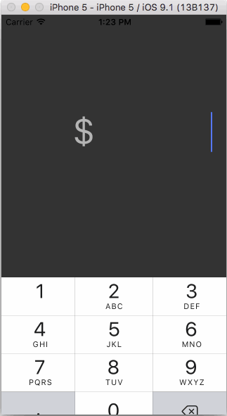

# Tip Calculator for Codepath pre-work

This is an iOS application for calculating the tip for a bill. It will also calculate the amount per person if it is split by 2, 3 o4 4 persons.

Time spent: 4 hours spent in total

Walkthrough of tip calculator:

GIF created with [LiceCap](http://www.cockos.com/licecap/).

