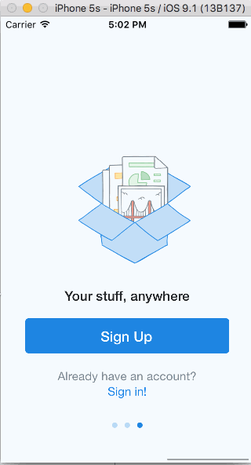

# Week 1 Project: Dropbox

This implements the Dropbox app from the signed out state to the basic signed in state.  This uses Xcode to implement the flow between the screens of the application.

Time spent: 11 hours spent in total

Completed user stories:

Required: User can tap through the 3 welcome screens.
Required: User can follow the create user flow.
Required: User can follow the sign in flow.
Optional: You should be able to swipe through the welcome screens instead of just tapping them.

Walkthrough of Dropbox app:

GIF created with [LiceCap](http://www.cockos.com/licecap/).

